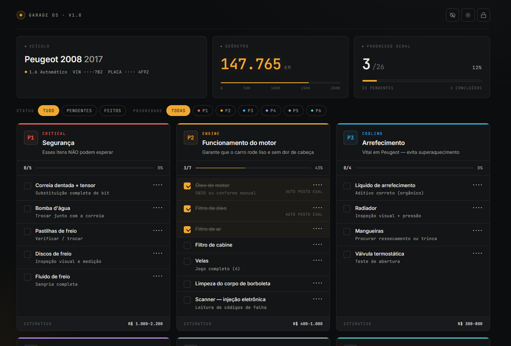

# Roadmap — Revisões Peugeot 2008

Este documento lista o que já foi entregue e o que vem pela frente. Cada passo tem **objetivo**, **porquê**, **o que fazer** e **feito quando** (critério de aceite).

---

## Já feito

| Passo | Entrega |
|---|---|
| A | Scaffold Next.js 16 + TypeScript |
| B | Design tokens, fontes (Inter + JetBrains Mono) e dataset estático |
| C | UI completa portada do protótipo HTML pra React + TS |
| D | Persistência no Supabase via API routes (`/api/items`, `/api/car`) |
| E | Deploy público na Vercel + auto-deploy a cada `git push origin main` |

URL pública: https://projeto-peugeot.vercel.app
Repositório: https://github.com/LuanPSX18/projeto-peugeot

---

## F — Feedback visual de "salvando..."

**Objetivo:** mostrar ao usuário quando o app está enviando dados pro servidor, e avisar caso falhe.

**Porquê:** hoje os PUTs são "fire and forget" — se a rede cair, o usuário marca um item, vê marcado na tela, mas nada chega no banco. Em silêncio. UX-wise, é o tipo de bug que destrói confiança quando descoberto.

**O que fazer:**
- Adicionar estado `saving: boolean` (ou um contador de requests em voo) no `app/page.tsx`.
- Em cada chamada `fetch` (toggle, edit, dismiss alert), incrementar antes da request e decrementar no `finally`.
- Mostrar um pequeno indicador na `TopBar` (ex.: ponto pulsando ao lado do logo "GARAGE OS · v1.0") quando `saving > 0`.
- Em caso de erro, mostrar um toast discreto: "Falha ao salvar — tente de novo".

**Feito quando:**
- Marcar um item com a aba de Network do DevTools no modo "Slow 3G" mostra o indicador "salvando" por 1-2s.
- Desligar a internet e marcar um item: aparece toast de erro, e o item volta ao estado original (rollback).

---

## G — Editar km do carro pela UI

**Objetivo:** poder atualizar a quilometragem direto no app, sem abrir o painel do Supabase.

**Porquê:** o `km` muda toda semana na vida real. Hoje precisa logar na Supabase, achar a tabela `car`, editar a linha 1 — fricção alta pra um campo que muda direto. O endpoint `PUT /api/car` já aceita `{km}` (foi feito no Passo D), só falta UI.

**O que fazer:**
- No `Cluster.tsx`, no painel "Odômetro", tornar o número clicável.
- Ao clicar, abrir um modal simples (pode reusar o estilo do `ItemEditor`) com um input numérico.
- No save: `PUT /api/car` com `{km: novoValor}`, otimistic update do estado local.
- Validação: km só pode aumentar (carro não anda pra trás). Se o usuário digitar valor menor, mostra aviso mas ainda permite (corrigir erro de digitação prévia).

**Feito quando:**
- Clico no `147.612` → abre modal → digito `148000` → salvo → número atualiza na hora → recarrego a página → continua `148.000`.
- Os cards do "Schedule" (próximas revisões) recalculam automaticamente baseado no novo km.

---

## H — Histórico de manutenção

**Objetivo:** registrar permanentemente cada serviço feito, com data, km na hora do serviço, preço e oficina — virando o histórico do carro a longo prazo.

**Porquê:** hoje quando você marca um item como "feito" e sobrescreve o preço, você perde o histórico. Daqui a 2 anos quando trocar a correia dentada de novo, você não vai lembrar quando trocou da última vez nem onde. Um histórico imutável resolve isso e vira documentação real do carro (útil pra revenda também).

**O que fazer:**
- Nova tabela no Supabase:
  ```sql
  CREATE TABLE maintenance_log (
    id          BIGSERIAL    PRIMARY KEY,
    item_id     TEXT         NOT NULL,    -- "p1-1", etc — REFERENCES items(id) opcional
    item_name   TEXT         NOT NULL,    -- denormalizado pra história não quebrar se o catálogo mudar
    done_at     TIMESTAMPTZ  NOT NULL DEFAULT now(),
    km_at       INT          NOT NULL,    -- km no momento do serviço
    price       NUMERIC,
    shop        TEXT,
    notes       TEXT
  );
  ```
- Endpoint `POST /api/maintenance` pra inserir uma linha.
- Endpoint `GET /api/maintenance?item_id=p1-1` pra listar histórico de um item específico, e `GET /api/maintenance` pra listar tudo.
- No editor do item, ao salvar com `done=true`, gravar uma linha no log automaticamente (com o km atual do carro).
- Nova seção no app: "Histórico" — timeline cronológica de todos os serviços feitos.

**Feito quando:**
- Marco um item como feito, preencho preço e oficina → aparece na seção Histórico com data e km daquele momento.
- Se eu desmarcar e marcar de novo no mesmo item, vira **duas linhas** no histórico (não uma só sobrescrita).
- Filtro o histórico por item ("ver últimas trocas de óleo") funciona.

**Trade-off importante:** isso muda a relação entre `items` e o histórico. `items` continua sendo "estado atual / já foi feito nessa rodada de revisão?", e `maintenance_log` é "tudo que já aconteceu no carro". Os dois coexistem.

---

## I — Foto da nota fiscal (Supabase Storage)

**Objetivo:** anexar foto da NF (ou recibo) a cada item / entrada do histórico.

**Porquê:** garantia, prova pra revenda, e organização. Você tira foto do recibo no celular, faz upload, e nunca mais perde.

**O que fazer:**
- Habilitar Supabase Storage no painel: criar bucket `receipts` (privado, só acessível via URL assinada).
- Adicionar coluna `receipt_url TEXT` em `maintenance_log` (e/ou `items`).
- No `ItemEditor`, adicionar input `<input type="file" accept="image/*">`.
- Endpoint `POST /api/upload` que recebe o arquivo, faz upload pra `receipts/{userId}/{timestamp}.jpg` (ver Passo J pra `userId`), e devolve a URL.
- Salvar a URL no item / log.
- Mostrar miniatura clicável quando existe.

**Feito quando:**
- No celular, clico em "anexar foto" no editor → câmera abre → tiro → faz upload → vejo a miniatura → fecho → reabro → ainda lá.
- A foto é privada — colar a URL bruta em outro navegador não abre (precisa de signed URL gerada pela API).

**Pré-requisito:** vale fazer **depois** do Passo J (Auth), porque `userId` ajuda a organizar e proteger o storage.

---

## J — Auth com Supabase

**Objetivo:** restringir edição ao seu próprio login. O site continua público pra ler (ou pra ver demo), mas só você marca itens.

**Porquê:** hoje qualquer pessoa que abrir https://projeto-peugeot.vercel.app pode marcar item, mudar km, descartar alerta. Pra portfólio público (que já é hoje) isso é estranho — alguém pode bagunçar enquanto um recrutador olha. Auth resolve isso.

**O que fazer:**
- No painel Supabase: ativar email/password ou OAuth (Google é mais simples).
- Migrar `lib/supabase.ts` pra ter dois clients:
  - `getSupabaseAdmin()` (service_role, server-only) — continua existindo pra leituras públicas.
  - `getSupabaseUserClient()` (anon key, pode rodar no browser) — usa sessão do usuário logado.
- Adicionar middleware Next.js que checa sessão em rotas que escrevem.
- Adicionar coluna `user_id UUID REFERENCES auth.users(id)` em `items` e `car`.
- Habilitar **RLS (Row Level Security)** nas tabelas: `SELECT` público (qualquer um lê), `INSERT/UPDATE/DELETE` só pro próprio `user_id`.
- UI: botão "Login" no canto da TopBar; se não logado, checkboxes ficam desabilitados ou abrem prompt de login.

**Feito quando:**
- Abro a URL em janela anônima → vejo a lista, mas checkboxes estão desabilitados (ou faltam botões de edição).
- Faço login → posso editar normalmente.
- Outro email logando vê **outros dados** (não os meus) — RLS funcionando.

**Decisão de produto (já tomada):** **single-user**. O dono é o único editor; o público só lê. Não tem cadastro, não tem multi-tenancy. Implementação:
- Uma única conta na Supabase Auth (a sua).
- RLS: `SELECT` público em `items`, `car`, `maintenance_log`. `INSERT/UPDATE/DELETE` restrito ao seu `user_id`.
- Como não tem fluxo de cadastro, a tela de login pode ser só um link discreto no rodapé (`/login`) — recrutador olhando o app não precisa nem saber que existe.

**Trade-off:** mais simples que multi-user, mas ainda é o passo mais complexo do roadmap por mexer em RLS + middleware de auth. Pode dividir em sub-passos: J1 = login básico funcionando, J2 = RLS aplicado nas tabelas, J3 = UI condicional (esconder botões de edição quando não logado).

---

## K — Polir o README com screenshot pra portfólio

**Objetivo:** fazer o README do GitHub vender o projeto visualmente em 3 segundos.

**Porquê:** hoje o README é texto puro. Quem cai lá pelo seu portfólio (recrutador, amigo dev) leva alguns segundos pra entender o que é. Uma screenshot resolve isso na hora — antes mesmo de ler o título.

**O que fazer:**
- Tirar screenshots em **alta resolução** (Retina / 2x):
  - Tela principal (desktop, dark mode) — o "money shot".
  - Mesma tela em mobile (celular real ou DevTools) — mostra responsividade.
  - Modal do editor aberto.
  - (Opcional) tela light mode.
- Salvar em `docs/screenshots/` no repo.
- Adicionar no topo do README, logo após a descrição:
  ```markdown
  
  ```
- Considerar um GIF curto (15-20s) mostrando a interação: marcar item → editar preço → ver salvar → recarregar → continua marcado. Ferramentas: ScreenToGif (Windows, gratuito).

**Feito quando:**
- Acessar https://github.com/LuanPSX18/projeto-peugeot e a primeira coisa visível abaixo da descrição é a screenshot.
- O README renderiza bem no GitHub mobile também (imagens não estouram a largura).

---

## Não-roadmap (decisões já tomadas, pra registro)

- **Sem Tailwind, sem CSS-in-JS** — CSS plano com tokens já basta pra um projeto desse tamanho.
- **Sem ORM** (Prisma/Drizzle) — o schema é trivial e o supabase-js resolve.
- **Sem state manager** (Redux/Zustand) — `useState` resolve.
- **Sem testes automatizados por enquanto** — projeto pessoal pequeno, custo > benefício neste estágio. Adicionar quando tiver lógica complexa (ex.: recálculo de schedule por km).
- **`theme` e `showMoney` ficam em `localStorage`** — preferências de UI por-dispositivo, não precisam sincronizar.

---

## Como atacar

Sugestão de ordem por **custo/benefício**:

1. **F** primeiro — pequeno, já melhora confiança no app que existe hoje.
2. **G** em seguida — pequeno, alto valor de uso (você vai atualizar km de verdade).
3. **K** quando quiser polir o portfólio (pode ser feito a qualquer momento).
4. **I** se quiser aprender Supabase Storage (escopo médio).
5. **H** quando quiser histórico permanente (escopo médio-grande).
6. **J** por último — mais complexo, e os outros não dependem dele tecnicamente (só se o app crescer pra multi-user).

Nada disso é obrigatório nem urgente. Escolha o próximo passo pelo que está te incomodando ou pelo que você quer aprender.
